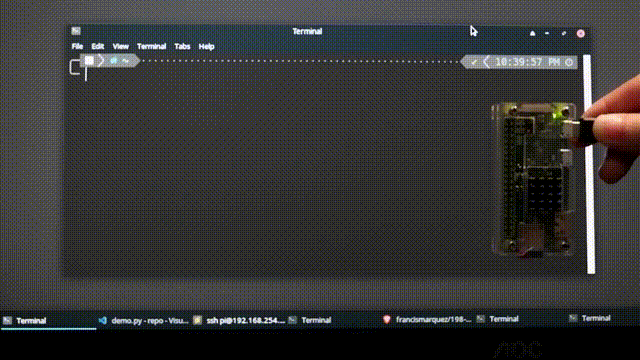
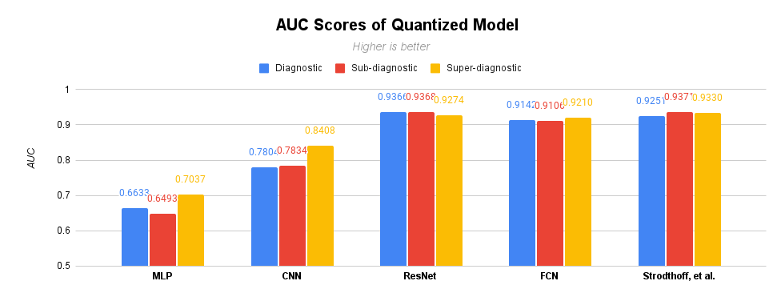
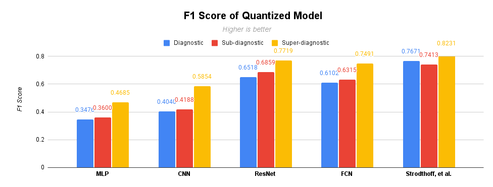
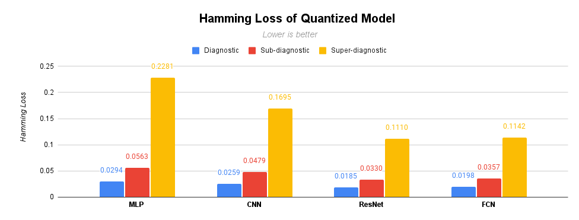
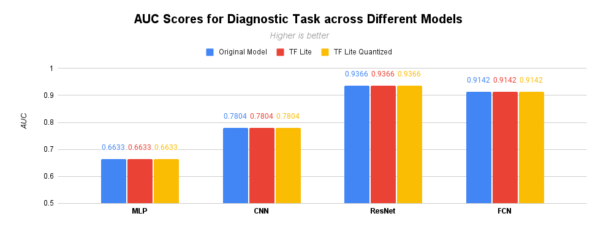
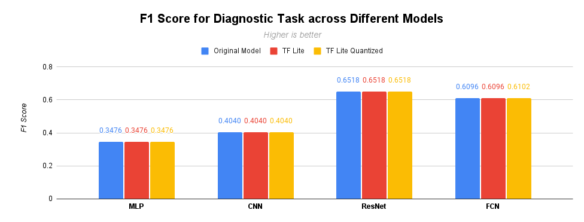
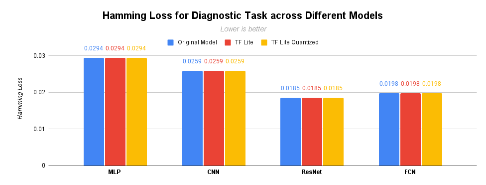
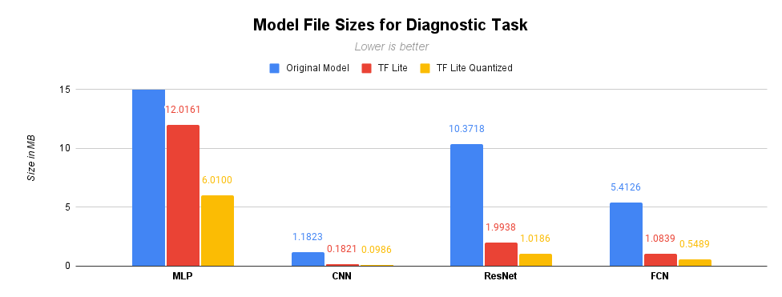
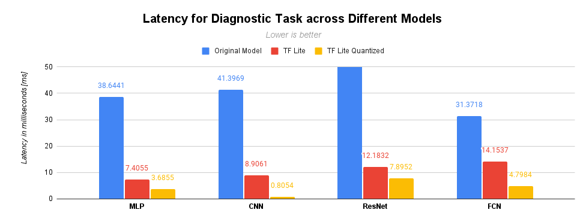

# On-device Classification of 12-lead Electrocardiograms (ECG's) using Deep Neural Networks for Time Series Classification

<!-- (https://colab.research.google.com/drive/1rJoNcwI-VBJkQ2kfjI5yXojx2hHtLj8W?usp=sharing) -->

Ranking highest among the leading causes of mortality both in the Philippines and worldwide are cardiovascular diseases (CVD). It is through a non-invasive diagnostic procedure called electrocardiography (ECG) can a patient's general cardiac condition be observed, which when paired with an early and accurate diagnosis could bring significant chances for successful treatment. However, ECG analysis is still heavily reliant on manual interpretation of experienced medical practitioners. Tackling this challenge and leveraging both advancements in deep learning techniques and on-device inference frameworks, a consumer-ready Android application was developed in this study capable of accepting raw ECG data as input and performing desired classification task giving an accurate ECG diagnosis pursuant to the SCP-ECG standard. Experiment results show retained performance of compressed models using TensorFlow Lite across different neural network architectures. Throughout four architectures analyzed for classification tasks, best models achieved AUC scores as high 93.7\% and H-loss as low as 0.02\%. Furthermore, validation of the project running on a Raspberry Pi Zero was conducted proving feasibility to run inference on a device with less compute resources. With both the smartphone application and RPi validation performing on-device inference, end-to-end ECG classification didn't require internet connectivity, reduced latency, and assured health data privacy.

<!-- Using TensorFlow a ResNet architecture with 11 convolutional layers is implemented and trained. Performance of this model is then compared with that of an optimized model generated using Tensorflow Lite. Preliminary findings show an approximately 90\% file size reduction of the original model while still performing a high of 0.93 AUC score. -->

## Demo

<table>
  <tr>
    <td></td>
    <td></td>
  </tr>
  <tr>
    <td><p align="center"><i>Android application walkthrough <br>running on Samsung Galaxy Note 3</i></p></td>
    <td><p align="center"><i>Validation on RPi Zero</i></p></td>
  </tr>
 </table>

## Contents

- [Demo](#demo)
- [Overview](#overview)
- [Results](#results)
  - [AUC Score](#auc-score)
  - [F1 Score](#f1-score)
  - [Hamming Loss](#hamming-loss)
  - [File Sizes](#file-sizes-mb)
  - [Consistency](#Consistency)
  - [Latency](#latency-milliseconds)
- [Dataset](#dataset)
- [Usage](#usage)
  - [Prerequisites](#prerequisites)
  - [Getting Started](#getting-started)
  - [Train](#train)
  - [Test](#test)
  - [Android](#android)
  - [Raspberry Pi Zero](#raspberry-pi-zero)

## Overview

The status quo in Philippine healthcare in terms of ECG analysis is still heavily realiant on manual interpretation by experienced medical practitioners. Though "automatic" ECG machines are accessible to higher-end hospitals, we have yet to overcome crucial challenges. Said machines still frequently give incorrect readings for arrhythmias, conduction disorders, and pacmeaker rhythms. Ultimately, systematic over-reading of these computerized interpretations by clinicans is still mandatory hence failing its attempt to alleviate the load on the already disadvantaged ratio of specialized physicians to patients. To date, there have been various works of using deep learning methods for ECG analysis, yet there is still no on-device 12-lead ECG classification software application that's publicly available.

Leveraging the existing studies and frameworks for ECG classification, this project aims to:

- evaluate and analyze different deep neural networks for time series classification on PTB-XL ECG dataset,
- develop an end-to-end smartphone application that will accept raw ECG data as input and classifica-
  tion inference as output,
- validate its feasibility on running inference on an RPi Zero,
- perform on-device inference, that is, data will not leave the device (e.g. will not be sent to the cloud
  for computational inference) and will operate under the local device’s specifications constraints, and
- and give 12-lead ECG classifications in compliance with the SCP-ECG standard with 0.90+
  AUC score.

<!-- TODO: explain that it is demonstrated in android using tf, android sdk api blabla and rpi zero to show a proof of concept that such can run on blabla -->

## Results

### AUC Score

<!-- <p align="middle">
  
</p> -->

<table>
  <tr>
    <td>
      
    </td>
    <td>
      <table>
        <thead>
          <tr>
            <th></th>
            <th colspan="3">
              <p align="center">Task</p>
            </th>
          </tr>
        </thead>
        <tbody>
          <tr>
            <td></td>
            <td><i>Diag</i></i></td>
            <td><i>Sub-<br>diag</i></td>
            <td><i>Super-<br>diag</i></td>
          </tr>
          <tr>
            <td>MLP</td>
            <td>0.6633</td>
            <td>0.6493</td>
            <td>0.7037</td>
          </tr>
          <tr>
            <td>CNN</td>
            <td>0.7804</td>
            <td>0.7834</td>
            <td>0.8408</td>
          </tr>
          <tr>
            <td>ResNet</td>
            <td>0.9366</td>
            <td>0.9368</td>
            <td>0.9274</td>
          </tr>
          <tr>
            <td>FCN</td>
            <td>0.9142</td>
            <td>0.9106</td>
            <td>0.9210</td>
          </tr>
          <tr>
            <td>Strodthoff, et al.</td>
            <td>0.937(08)</td>
            <td>0.930(10)</td>
            <td>0.933(06)</td>
          </tr>
        </tbody>
      </table>
    </td>
  </tr> 
</table>

### F1 Score

<!-- <p align="middle">
  
</p> -->

<table>
  <tr>
    <td>
      
    </td>
    <td>
      <table>
        <thead>
          <tr>
            <th></th>
            <th colspan="3">
              <p align="center">Task</p>
            </th>
          </tr>
        </thead>
        <tbody>
          <tr>
            <td></td>
            <td><i>Diag</i></i></td>
            <td><i>Sub-<br>diag</i></td>
            <td><i>Super-<br>diag</i></td>
          </tr>
          <tr>
            <td>MLP</td>
            <td>0.3476</td>
            <td>0.3600</td>
            <td>0.4685</td>
          </tr>
          <tr>
            <td>CNN</td>
            <td>0.4040</td>
            <td>0.4188</td>
            <td>0.5854</td>
          </tr>
          <tr>
            <td>ResNet</td>
            <td>0.6518</td>
            <td>0.6859</td>
            <td>0.7719</td>
          </tr>
          <tr>
            <td>FCN</td>
            <td>0.6102</td>
            <td>0.6315</td>
            <td>0.7491</td>
          </tr>
          <tr>
            <td>Strodthoff, et al.</td>
            <td>0.741(13)</td>
            <td>0.762(12)</td>
            <td>0.823(10)</td>
          </tr>
        </tbody>
      </table>
    </td>
  </tr> 
</table>

### Hamming Loss

<!-- <p align="middle">
  
</p> -->

<table>
  <tr>
    <td>
      
    </td>
    <td>
      <table>
        <thead>
          <tr>
            <th></th>
            <th colspan="3">
              <p align="center">Task</p>
            </th>
          </tr>
        </thead>
        <tbody>
          <tr>
            <td></td>
            <td><i>Diag</i></i></td>
            <td><i>Sub-<br>diag</i></td>
            <td><i>Super-<br>diag</i></td>
          </tr>
          <tr>
            <td>MLP</td>
            <td>0.0294</td>
            <td>0.0563</td>
            <td>0.2281</td>
          </tr>
          <tr>
            <td>CNN</td>
            <td>0.0259</td>
            <td>0.0479</td>
            <td>0.1695</td>
          </tr>
          <tr>
            <td>ResNet</td>
            <td>0.0185</td>
            <td>0.0330</td>
            <td>0.1110</td>
          </tr>
          <tr>
            <td>FCN</td>
            <td>0.0198</td>
            <td>0.0357</td>
            <td>0.1142</td>
          </tr>
        </tbody>
      </table>
    </td>
  </tr> 
</table>

### Consistency

<!-- Notice that across all models (original TF model, Non-quantized TFLite Model, and Quantized TFLite Model) indeed offer the same consistent performance according to the metrics used in this project. -->

<p align="middle"> 
  
  
  
</p>

### File Sizes [MB]

<!-- <p align="middle">
  
  </span>
</p> -->

<table>
  <tr>
    <td>
      
    </td>
    <td>
      <table>
        <thead>
          <tr>
            <th></th>
            <th colspan="3">
              <p align="center">Task</p>
            </th>
          </tr>
        </thead>
        <tbody>
          <tr>
            <td></td>
            <td><i>Orig</i></i></td>
            <td><i>Non-<br>quantized</i></td>
            <td><i>Quantized</i></td>
          </tr>
          <tr>
            <td>MLP</td>
            <td>54.388</td>
            <td>12.016</td>
            <td>6.0100</td>
          </tr>
          <tr>
            <td>CNN</td>
            <td><strong>1.1823</strong></td>
            <td><strong>0.1821</strong></td>
            <td><strong>0.0986</strong></td>
          </tr>
          <tr>
            <td>ResNet</td>
            <td>10.373</td>
            <td>1.9938</td>
            <td>1.0186</td>
          </tr>
          <tr>
            <td>FCN</td>
            <td>5.4126</td>
            <td>1.0839</td>
            <td>0.5489</td>
          </tr>
        </tbody>
      </table>
    </td>
  </tr> 
</table>

### Latency [milliseconds]

<!-- <p align="middle">
  
</p> -->

<table>
  <tr>
    <td>
      
    </td>
    <td>
      <table>
        <thead>
          <tr>
            <th></th>
            <th colspan="3">
              <p align="center">Task</p>
            </th>
          </tr>
        </thead>
        <tbody>
          <tr>
            <td></td>
            <td><i>Diag</i></i></td>
            <td><i>Sub-<br>diag</i></td>
            <td><i>Super-<br>diag</i></td>
          </tr>
          <tr>
            <td>MLP</td>
            <td>38.6441</td>
            <td><strong>7.4055</strong></td>
            <td>3.6855</td>
          </tr>
          <tr>
            <td>CNN</td>
            <td>41.397</td>
            <td>8.9061</td>
            <td><strong>0.8054</strong></td>
          </tr>
          <tr>
            <td>ResNet</td>
            <td>59.641</td>
            <td>12.183</td>
            <td>7.8952</td>
          </tr>
          <tr>
            <td>FCN</td>
            <td><strong>31.372</strong></td>
            <td>14.154</td>
            <td>4.7984</td>
          </tr>
        </tbody>
      </table>
    </td>
  </tr> 
</table>

## Dataset

This project made use of the [PTB-XL ECG Dataset](https://physionet.org/content/ptb-xl/1.0.1/), the to-date largest accessible clinical 12-lead ECG-waveform datset with 21,837 records from 188,885 patients of 10 seconds length. Annotated by two cardiologists, classifications of ECG come from a set of 71 different statements conforming to the [SCP-ECG](https://www.iso.org/standard/46493.html) standard.

You can download the dataset on your local machine by running the [`dataset.sh`](../main/dataset.sh) in this repo.

```zsh
cd eee-198
chmod +x datset.sh
./dataset.sh
```

## Usage

### Prerequisites

1. [Git](https://git-scm.com/downloads)
2. [Conda](https://docs.conda.io/en/latest/)
3. [Python 3](https://www.python.org/downloads/)
4. [Android Studio](https://developer.android.com/studio)
5. [Raspberry Pi Zero W](https://www.raspberrypi.org/products/raspberry-pi-zero-w/)
<!-- android -->

### Getting Started

- Clone this repository

```zsh
git clone git@github.com:francismarquez/eee-198.git
```

- Create and prepare your environment

```zsh
conda create -n <env> python==3.8
conda activate <env>b
cd eee-198
pip install -r requirements.txt # or $ conda install --file requirements.txt
```

### Train

```zsh
python train.py --task diagnostic \
--network-arch MLP-1D  --data-folder ./data/ptbxl/ \
--output-folder ./output/ --batch-size 64 --epochs 30 --init
```

### Test

- Access pre-trained models [here](https://tinyurl.com/pretrained-models).
- Interactive walkthrough here: [](https://colab.research.google.com/drive/1R2sgqWkojBDvyum0bGX-I2T1aABI_SME?usp=sharing)

```zsh
python test.py --task diagnostic\
--model ./models/FCN-1D_diagnostic/ \
--x-val ./data/ptbxl/X_val.npy \
--y-val ./data/ptbxl/y_val.npy
```

  <!-- https://github.com/francismarquez/eee-198/blob/main/demo.ipynb -->

- Demo script [here](./demo.py)

```zsh
python demo.py --input x_val_0.csv --task diagnostic
```

### Android

1. Open Android Studio.
2. `Open an existing project` > `eee-198/android`
3. On the Menu Bar, click on `Build` and select `Make Project`. `build.gradle` will prompt to download any missing libraries. You'll need at least SDK version 19 to run this project.
4. Plug desired Android device to your computer via USB _(alternatively, you can choose to test run this using an emulator within Android studio. Just download desired device using the AVD Manager)_
5. On the Menu Bar, click on `Run` then `Run app`
6. Put test input files from [here](./rpi_zero/sample_input), to your Android device's `Download` folder.
7. Open the app. `Load CSV` > Select desired input CSV file
8. `Analyze`

### Raspberry Pi Zero

For official documentation and datasheets on the RPi Zero, you can check it [here](https://www.raspberrypi.org/products/raspberry-pi-zero-w/). If you're based in the Philippines, you can buy one [here](https://www.raspberrypi.org/products/raspberry-pi-zero/).

1. Flash Raspberry Pi OS using [Raspberry Pi Imager](https://www.raspberrypi.org/software/) on a MicroSD card
2. For ease of use, we will leverage headless access to the RPi Zero (i.e., connecting via [SSH](https://en.wikipedia.org/wiki/Secure_Shell_Protocol) instead of needing a separate monitor and computer peripherals)
3. Create an empty file named `ssh` on the SD card's `/boot` directory

If you're on Windows:

- Open **Notepad**. Create a new file with nothing on it
- **File / Save As**
- Set **Save as type** to **All Files**
- Rename to `ssh` then **Save**

If you're on Linux/Mac:

```zsh
touch ssh
```

4. Using the same process, create a `wpa_supplicant.conf` file in the `/boot` directory with the following content: _Don't remove the quotation marks in the ssid and password field._

```
ctrl_interface=DIR=/var/run/wpa_supplicant GROUP=netdev
update_config=1
country=ph

network={
    ssid="your_ssid"
    psk="your_password"
    scan_ssid=1
}
```

5. Boot up your RPi Zero. You can identify what is its IP adress in your local network with `arp -a`. If previous steps are done right, you should be able to detect and access the RPi Zero via SSH shortly after booting it. Note that by default, username is **_pi_** and password is **_raspberry_**

```zsh
ssh pi@<ip_address_of_rpi>
cd ~/ && mkdir ecgTest
```

On your host PC,

```zsh
scp -r eee-198/rpi_zero/ <ip_address_of_rpi>:~/ecgTest
```

6. Prep RPi environment.

```zsh
sudo apt install python3-pip python3-venv libatlas-base-dev
pip3 install virtualenv
python3 -m venv myenv

cd ~/ecgTest
source ~/myenv/bin/activate

pip3 install https://github.com/lhelontra/tensorflow-on-arm/releases/download/v2.0.0/tensorflow-2.0.0-cp37-none-linux_armv6l.whl --no-cache-dir
pip3 install numpy
```

7. Run demo script for RPi Zero.

```zsh
python3 demo.py --input x_val_0.csv --task diagnostic
```
